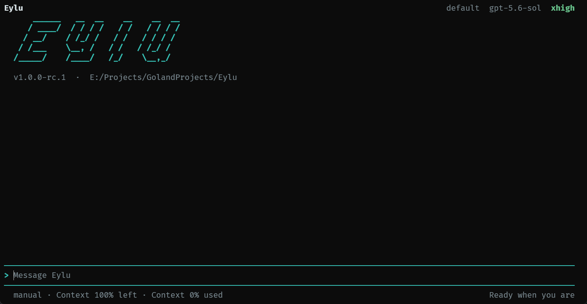

# Eylu

简体中文 | [English](README_EN.md)

面向本地代码库的终端编程 Agent。Eylu 在你的工作区中理解代码、调用工具、执行计划并保存会话，同时兼容 OpenAI Responses 与 Chat Completions 风格的 HTTP 网关。

[下载](https://github.com/xnqycs/Eylu/releases) · [更新日志](CHANGELOG.md) · [发版指南](RELEASING.md) · [License](LICENSE)

<p align="center">
  
</p>

## 为什么选择 Eylu

| 能力 | 使用体验 |
|---|---|
| 本地代码库上下文 | 自动采集项目结构、Git 状态与相关文件，引用内容受工作区边界保护 |
| 完整 Agent 循环 | 支持模型流式输出、多轮工具调用、任务清单、提问与执行审计 |
| 可控的工具权限 | `manual`、`plan`、`auto`、`full` 四种模式覆盖审阅、规划和自动执行 |
| 长会话管理 | 持久化会话、Prompt 历史、任务状态和上下文账本，支持压缩与恢复 |
| 多 Provider 路由 | 按任务、能力、上下文窗口、优先级和成本选择模型 |
| 可扩展能力 | 支持 Agent Skills、签名 Skill 仓库以及 MCP stdio server |

Eylu 提供全屏 TUI，也能以纯文本、JSON 或 JSONL 方式接入脚本和自动化流程。

## 安装

### 下载预编译版本

从 [GitHub Releases](https://github.com/xnqycs/Eylu/releases) 下载与系统匹配的归档：

| 系统 | x64 | ARM64 |
|---|---|---|
| Windows | `Eylu_<version>_Windows_amd64.zip` | `Eylu_<version>_Windows_arm64.zip` |
| Linux | `Eylu_<version>_Linux_amd64.tar.gz` | `Eylu_<version>_Linux_arm64.tar.gz` |
| macOS | `Eylu_<version>_Darwin_amd64.tar.gz` | `Eylu_<version>_Darwin_arm64.tar.gz` |

解压后检查版本：

```powershell
# Windows
.\eylu.exe version
```

```bash
# Linux / macOS
chmod +x eylu
./eylu version
```

后续示例假设 `eylu` 已在 `PATH` 中。Windows 可将解压目录加入用户 `Path`；Linux 和 macOS 可将程序安装到用户命令目录：

```bash
mkdir -p "$HOME/.local/bin"
install -m 755 eylu "$HOME/.local/bin/eylu"
```

确保 `$HOME/.local/bin` 已加入 `PATH`。

每个归档只包含主程序。Release 同时提供 SHA-256 校验文件和 Sigstore bundle，验证方法见 [发版指南](RELEASING.md#5-发布后验证)。

### 从源码构建

需要 Go 1.25.8 或更高版本：

```bash
git clone https://github.com/xnqycs/Eylu.git
cd Eylu
go build -trimpath -o eylu .
go test ./...
```

## 快速开始

### 1. 启动 TUI

进入需要处理的项目目录，直接运行 Eylu：

```bash
cd path/to/your-project
eylu
```

首次启动会先显示 Provider 配置引导：

1. 确认 Provider 名称和 API Base URL。
2. 输入 API Key，输入过程会隐藏字符。
3. 从自动发现的模型中选择，或手动填写模型 ID。
4. 确认模型上下文窗口。

配置完成后，Eylu 会自动进入全屏 TUI。后续启动会直接使用已保存的 Provider。Provider 和 API Key 会保存到 `~/.eylu/config.toml`。

### 2. 开始对话

在底部输入框描述任务并按 `Enter`。Eylu 会读取当前工作区上下文，展示工具执行、任务进度和上下文用量。

常用交互命令：

```text
/help       查看命令
/new        创建新会话
/tasks      查看完整任务清单
/context    查看上下文使用情况
/providers  管理 Provider
/model      切换模型
/effort     调整思考等级
/skills     查看 Skills
/mode       切换权限模式
/quit       退出
```

### 环境变量与命令行配置

环境变量适合临时凭据和自动化环境：

```powershell
# Windows PowerShell
$env:EYLU_API_KEY="your-api-key"
```

```bash
# Linux / macOS
export EYLU_API_KEY="your-api-key"
```

提前创建 Responses Provider：

```bash
eylu providers add work --base-url "https://api.example.com/v1" --model "your-model-id"
eylu providers list
```

Chat Completions 兼容网关需要指定 adapter：

```bash
eylu providers add work-chat --adapter openai_chat --base-url "https://api.example.com/v1" --model "your-model-id"
```

配置完成后运行 `eylu` 进入 TUI。`EYLU_API_KEY` 会在请求时覆盖 Provider 中保存的 Key。

## 常用工作流

### 单次请求

```bash
eylu --no-tui "检查当前项目并给出风险清单"
```

### 按 ID 恢复会话

```bash
eylu --resume auth-review
eylu chat --resume auth-review
```

`--resume <session-id>` 精确加载当前工作区中已存在的会话；ID 无效、缺失、损坏或属于其他工作区时返回非零退出码，会话存储保持原样。交互式文本会话退出后会打印可直接执行的恢复命令。

`--session <id>` 保留“打开已有会话或按 ID 创建会话”的用途：

```bash
eylu "审查认证模块" --session auth-review
eylu --resume auth-review "继续修复"
eylu sessions list
eylu sessions show auth-review --output json
```

### 脚本化输出

```bash
eylu --no-tui --output jsonl "检查项目并运行测试"
```

JSONL 会逐行输出路由、上下文、模型、工具审计和最终响应事件，适合日志采集与自动化消费。

### 自动选择 Provider

为 Provider 声明任务和优先级：

```bash
eylu providers add coding --base-url "https://api.example.com/v1" --model "coding-model" --routing-task coding,debugging,testing --routing-priority 20
```

发起自动路由请求：

```bash
eylu --route auto --task review "审查本次修改并运行测试"
```

路由器会综合任务匹配、模型能力、有效上下文窗口、优先级和已配置成本，并输出选择依据。

## 权限模式

| 模式 | 行为 |
|---|---|
| `manual` | 读取自动执行；写入和命令等待确认；高危操作二次确认 |
| `plan` | 隔离的规划 Agent 只使用读取能力，完成后由用户选择执行方式 |
| `auto` | 白名单写入与命令自动执行；未知命令等待确认；高危操作二次确认 |
| `full` | 普通操作自动执行；高危操作显示警告并等待确认 |

启动时指定模式：

```bash
eylu --mode plan
```

TUI 中可通过 `Shift+Tab` 在四种模式间循环。运行期间的切换会在下一轮生效。

## Skills 与 MCP

Eylu 按以下优先级发现 Agent Skills：

```text
<workspace>/.eylu/skills
<workspace>/.agents/skills
~/.eylu/skills
~/.agents/skills
```

项目级 Skill 需要工作区信任。可以先诊断再启用：

```bash
eylu skills list
eylu skills validate ".agents/skills/code-review"
eylu skills diagnose --output json
```

MCP server 通过 stdio 子进程接入，配置放在 Eylu TOML 中：

```toml
[mcp_servers.repository]
command = "repo-mcp"
args = ["serve", "--stdio"]
environment = ["REPO_MCP_TOKEN"]
working_directory = "."
read_only_tools = ["search", "inspect"]
timeout_seconds = 30
```

```bash
eylu mcp list
eylu mcp inspect repository --output json
```

MCP 环境变量按名称白名单转发；只读工具仍需在本地配置中显式声明。

## 配置与数据

配置加载优先级：

```text
命令行参数 > EYLU_* 环境变量 > <workspace>/.eylu/config.toml > ~/.eylu/config.toml > 默认值
```

常用路径：

| 内容 | 默认位置 |
|---|---|
| 用户配置 | `~/.eylu/config.toml` |
| 项目配置 | `<workspace>/.eylu/config.toml` |
| 会话与模型缓存 | `~/.eylu/state/` |
| 项目 Skills | `<workspace>/.eylu/skills/`、`<workspace>/.agents/skills/` |

`EYLU_WORKSPACE` 可以覆盖当前工作区，`EYLU_STATE_DIR` 可以修改状态目录。API Key、Provider headers 和其他凭据不会写入会话文件。

### 并行工具调用

Eylu 会让模型在同一轮返回相互独立的工具调用，并根据文件、目录和会话状态依赖进行资源感知调度。只读工具、只读 Bash 命令和不同文件的写入可以并行；同一文件的写入以及交互、会话状态操作会保持有序执行。

```toml
max_parallel_tools = 4
```

默认并发上限为 `4`。设为 `1` 可让工具串行执行；环境变量 `EYLU_MAX_PARALLEL_TOOLS` 可临时覆盖该值。明确声明为只读的 MCP 工具可参与并行调度，其他 MCP 工具采用独占执行。

## 终端兼容性

- 交互式 TTY 默认启动 Bubble Tea 全屏界面。
- `--no-animation` 保留静态主题并关闭动态效果。
- `--no-tui` 使用纯文本交互。
- `NO_COLOR` 移除 ANSI 颜色。
- `TERM=dumb`、管道和结构化输出自动使用静态路径。

## 项目文档

- [CHANGELOG.md](CHANGELOG.md)：版本变更记录
- [RELEASING.md](RELEASING.md)：版本、签名、CI 和故障恢复流程
- [THIRD_PARTY_NOTICES.md](THIRD_PARTY_NOTICES.md)：第三方组件与适用条款
- [docs/go-terminal-agent-development-plan.md](docs/go-terminal-agent-development-plan.md)：架构与阶段开发记录

## 开发与验证

```bash
gofmt -l .
go mod verify
go vet ./...
go test ./...
go test -race ./...
go run ./scripts/generate-third-party-notices -check
staticcheck ./...
actionlint
```

CI 会在 Linux、Windows、macOS 上执行测试、原生构建和 smoke test；发布标签会进一步生成六个平台归档、SHA-256 校验与 Sigstore 签名。

## 许可证

Eylu 由 xnqycs 以 [Apache License 2.0](LICENSE) 发布。第三方组件及其适用条款见 [THIRD_PARTY_NOTICES.md](THIRD_PARTY_NOTICES.md)。
