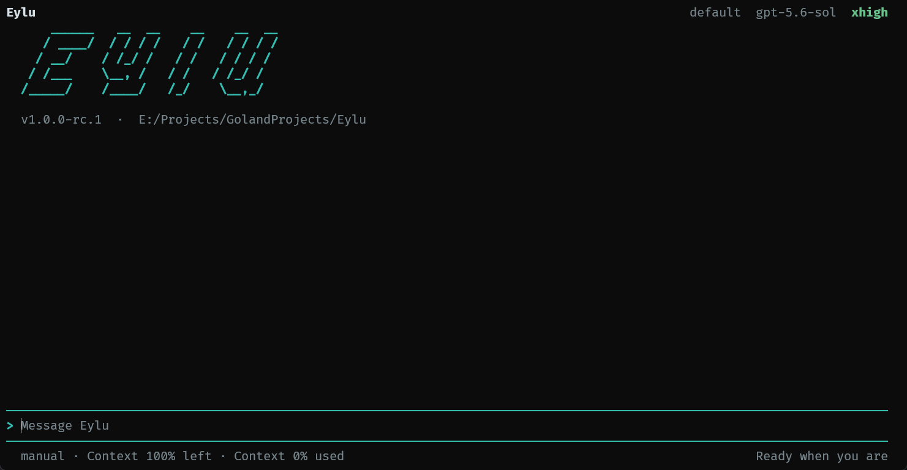

# Eylu

简体中文 | [English](README_EN.md)

面向本地代码库的终端编程 Agent。Eylu 在你的工作区中理解代码、调用工具、执行计划并保存会话，同时兼容 OpenAI Responses 与 Chat Completions 风格的 HTTP 网关。

[下载](https://github.com/xnqycs/Eylu/releases) · [更新日志](CHANGELOG.md) · [发版指南](RELEASING.md) · [License](LICENSE)

<p align="center">
  
</p>

## 为什么选择 Eylu

| 能力 | 使用体验 |
|---|---|
| 本地代码库上下文 | 自动采集项目结构、Git 状态与相关文件，引用内容受工作区边界保护 |
| 完整 Agent 循环 | 支持模型流式输出、多轮工具调用、任务清单、提问与执行审计 |
| 可控的工具权限 | `manual`、`plan`、`auto`、`full` 四种模式覆盖审阅、规划和自动执行 |
| 长会话管理 | 持久化会话、Prompt 历史、任务状态和上下文账本，支持压缩与恢复 |
| 多 Provider 路由 | 按任务、能力、上下文窗口、优先级和成本选择模型 |
| 可扩展能力 | 支持 Agent Skills、签名 Skill 仓库以及 MCP stdio、Streamable HTTP、SSE server |

Eylu 提供全屏 TUI，也能以纯文本、JSON 或 JSONL 方式接入脚本和自动化流程。

## 安装

### 下载预编译版本

从 [GitHub Releases](https://github.com/xnqycs/Eylu/releases) 下载与系统匹配的归档：

| 系统 | x64 | ARM64 |
|---|---|---|
| Windows | `Eylu_<version>_Windows_amd64.zip` | `Eylu_<version>_Windows_arm64.zip` |
| Linux | `Eylu_<version>_Linux_amd64.tar.gz` | `Eylu_<version>_Linux_arm64.tar.gz` |
| macOS | `Eylu_<version>_Darwin_amd64.tar.gz` | `Eylu_<version>_Darwin_arm64.tar.gz` |

解压后检查版本：

```powershell
# Windows
.\eylu.exe version
```

```bash
# Linux / macOS
chmod +x eylu
./eylu version
```

后续示例假设 `eylu` 已在 `PATH` 中。Windows 可将解压目录加入用户 `Path`；Linux 和 macOS 可将程序安装到用户命令目录：

```bash
mkdir -p "$HOME/.local/bin"
install -m 755 eylu "$HOME/.local/bin/eylu"
```

确保 `$HOME/.local/bin` 已加入 `PATH`。

每个归档只包含主程序。Release 同时提供 SHA-256 校验文件和 Sigstore bundle，验证方法见 [发版指南](RELEASING.md#5-发布后验证)。

### 从源码构建

需要 Go 1.25.8 或更高版本：

```bash
git clone https://github.com/xnqycs/Eylu.git
cd Eylu
go build -trimpath -o eylu .
go test ./...
```

## 快速开始

### 1. 启动 TUI

进入需要处理的项目目录，直接运行 Eylu：

```bash
cd path/to/your-project
eylu
```

首次启动会先显示 Provider 配置引导：

1. 确认 Provider 名称和 API Base URL。
2. 输入 API Key，输入过程会隐藏字符。
3. 从自动发现的模型中选择，或手动填写模型 ID。
4. 确认模型上下文窗口。

配置完成后，Eylu 会自动进入全屏 TUI。后续启动会直接使用已保存的 Provider。Provider 和 API Key 会保存到 `~/.eylu/config.toml`。

### 2. 开始对话

在底部输入框描述任务并按 `Enter`。Eylu 会读取当前工作区上下文，展示工具执行、任务进度和上下文用量。

常用交互命令：

```text
/help       查看命令
/new        创建新会话
/tasks      查看完整任务清单
/context    查看上下文使用情况
/providers  管理 Provider
/model      切换模型
/effort     调整思考等级
/skills     查看 Skills
/mode       切换权限模式
/quit       退出
```

### 环境变量与命令行配置

环境变量适合临时凭据和自动化环境：

```powershell
# Windows PowerShell
$env:EYLU_API_KEY="your-api-key"
```

```bash
# Linux / macOS
export EYLU_API_KEY="your-api-key"
```

提前创建 Responses Provider：

```bash
eylu providers add work --base-url "https://api.example.com/v1" --model "your-model-id"
eylu providers list
```

Chat Completions 兼容网关需要指定 adapter：

```bash
eylu providers add work-chat --adapter openai_chat --base-url "https://api.example.com/v1" --model "your-model-id"
```

配置完成后运行 `eylu` 进入 TUI。`EYLU_API_KEY` 会在请求时覆盖 Provider 中保存的 Key。

### 托管 Web Search 与 Web Fetch

Eylu 将 `web_search`、`web_fetch` 与普通 function tool 分开建模，并根据 `catalog_provider + adapter + model` 解析能力。已识别且支持 Web 能力的 Provider 会自动发布可执行工具；兼容网关可通过 `web_capabilities` 显式声明能力。Web 权限默认是 `allow`，搜索和抓取可直接执行；显式设置 `ask` 或 `deny` 可恢复确认或禁用策略。兼容 Responses 中转上的 GPT 模型会把同轮 `queries` 交给 Eylu 受控扇出，单批最多 10 条并发查询，完成后按原查询顺序归并为一个工具结果；`max_uses` 仍按模型发起的工具调用计数。TUI 会把批量查询拆成独立子项，并展示实际搜索词、打开的 URL 和来源；折叠态最多保留最新 5 项，`▸ … +N hidden` 显示隐藏数量，点击该行可展开或收起完整记录。

| Adapter | 原生 Web 映射 |
|---|---|
| `openai_responses` | Responses hosted search/fetch；支持 OpenAI、xAI 与 OpenRouter 方言 |
| `openai_chat` | Chat hosted search；支持 OpenRouter、Groq Compound 与 Qwen/DashScope 选项 |
| `anthropic_messages` | 版本化 server tools，并在单次请求内处理 `pause_turn` 续接 |
| `gemini_interactions` | `google_search` 与 `url_context` |
| `mistral_conversations` | standard/premium Web search |
| `perplexity_agent` | `web_search` 与 `fetch_url` |

核心 CLI 配置示例：

```bash
eylu providers edit work --catalog-provider openai --web-permission allow --web-search auto --web-fetch auto --web-max-uses 5 --web-context-size medium
```

完整 TOML 示例包含 hosted 能力覆盖、delegated fallback 和 MCP client fallback：

```toml
[providers.work.web_tools]
permission = "allow"

[providers.work.web_tools.search]
enabled = true
execution = "auto"
fallback = "delegated"
delegated_provider = "web-backup"
allowed_domains = ["example.com"]
blocked_domains = ["private.example.com"]
max_uses = 5
context_size = "medium"

[providers.work.web_tools.fetch]
enabled = true
execution = "client"
client_tool = "mcp__web__fetch"
trusted_network_boundary = true
max_uses = 3

[providers.work.web_capabilities]
hosted_web_search = true
hosted_web_fetch = true
hosted_tool_streaming = true
hosted_and_function_tools = true
search_domain_filter = true
search_location = true
search_usage_details = true
```

`execution` 支持 `auto`、`hosted`、`delegated`、`client`。`auto` 优先当前模型的 hosted 能力，并按显式 `fallback` 转入另一个已配置 Provider 或指定 MCP 工具。MCP fetch 必须设置 `trusted_network_boundary = true`；Eylu 会校验初始 HTTP(S) URL、凭据、域名规则及解析后的公网地址，MCP server 负责在可信边界内对重定向和后续 DNS 解析执行同等检查。

Hosted 会把查询、URL、域名规则、位置和允许的 Provider 选项发送给当前 Provider；delegated 会发送给目标 Provider；client 会把 canonical `query` 或 `url` 发送给指定 MCP server。Web 内容统一标记为不可信输入。活动、引用、Web token、费用和 backend 会进入协议事件、会话、JSON/JSONL、指标与审计记录。日志继续应用现有凭据脱敏。

## 常用工作流

### 单次请求

```bash
eylu --no-tui "检查当前项目并给出风险清单"
```

### 按 ID 恢复会话

```bash
eylu --resume auth-review
eylu chat --resume auth-review
```

`--resume <session-id>` 精确加载当前工作区中已存在的会话；ID 无效、缺失、损坏或属于其他工作区时返回非零退出码，会话存储保持原样。TUI 和 `--no-tui` 交互模式会显示已恢复的消息与工具历史并定位到最新内容；带 prompt 的一次性调用继续只输出本轮结果。交互式文本会话退出后会打印可直接执行的恢复命令。

`--session <id>` 保留“打开已有会话或按 ID 创建会话”的用途：

```bash
eylu "审查认证模块" --session auth-review
eylu --resume auth-review "继续修复"
eylu sessions list
eylu sessions show auth-review --output json
```

### 脚本化输出

```bash
eylu --no-tui --output jsonl "检查项目并运行测试"
```

JSONL 会逐行输出路由、上下文、模型、工具审计和最终响应事件，适合日志采集与自动化消费。

### 自动选择 Provider

为 Provider 声明任务和优先级：

```bash
eylu providers add coding --base-url "https://api.example.com/v1" --model "coding-model" --routing-task coding,debugging,testing --routing-priority 20
```

发起自动路由请求：

```bash
eylu --route auto --task review "审查本次修改并运行测试"
```

路由器会综合任务匹配、模型能力、有效上下文窗口、优先级和已配置成本，并输出选择依据。

## 权限模式

| 模式 | 行为 |
|---|---|
| `manual` | 读取自动执行；写入和命令等待确认；高危操作二次确认 |
| `plan` | 隔离的规划 Agent 只使用读取能力，完成后由用户选择执行方式 |
| `auto` | 白名单写入与命令自动执行；未知命令等待确认；高危操作二次确认 |
| `full` | 普通操作自动执行；高危操作显示警告并等待确认 |

启动时指定模式：

```bash
eylu --mode plan
```

TUI 中可通过 `Shift+Tab` 在四种模式间循环。运行期间的切换会在下一轮生效。

### 只读命令判定与权限组合

`plan` 模式只放行能够证明无副作用的命令；`auto` 模式的白名单前缀不会绕过这一判定。

- 命令按命令行逐段解析，只有每一段都能证明无副作用时才归类为只读。
- 参数按命令单独校验。`find` 的 `-delete`、`-exec`、`-execdir`、`-fprint`，`git branch` 的 `-d`、`-D`、`-m`、`-M`、`-c`、`-C`、"`--delete`"、"`--set-upstream-to`"，`git diff`/`git log`/`git show` 的 `--ext-diff`、`--textconv`、`--output`、`--show-signature`，`git grep -O`，以及 `git -c`、`--config-env`、`--exec-path`、`--paginate` 等参数被判定为高危，而不是只读。
- 只读命令的短选项区分大小写，因此 `pwd -P` 是只读，`git grep -O` 会被判定为高危。
- 无法可靠解释的输入回退为 unknown：未闭合引号、变量或命令替换（`$VAR`、`$(...)`）、管道、重定向、反引号，以及在 `read_only_commands` 中自定义、但没有内置参数规则的命令所携带的参数。`plan` 模式拒绝 unknown，`manual`/`auto` 按各自模式要求确认。
- 权限分层为：不可绕过的禁止规则、模式默认策略、工具领域策略（例如 Web 独立权限）、显式审批结果。明确的全局禁止不会被工具级策略放宽；零值或无法识别的权限决策一律按拒绝处理。
- 审计记录保留模式、命中的规则、最终决策和覆盖来源。

行为变化：此前仅按命令前缀无条件放行的参数形式（如 `find . -delete`、`git branch -D`、`git diff --ext-diff`）现在会被判定为高危或 unknown。

命令分类只是应用层策略，不等同于操作系统沙箱：`working_directory` 只决定命令的启动目录，不限制命令自身能访问的路径。

## Skills 与 MCP

Eylu 按以下优先级发现 Agent Skills：

```text
<workspace>/.eylu/skills
<workspace>/.agents/skills
~/.eylu/skills
~/.agents/skills
```

项目级 Skill 需要工作区信任。可以先诊断再启用：

```bash
eylu skills list
eylu skills validate ".agents/skills/code-review"
eylu skills diagnose --output json
```

MCP server 支持 `stdio`、`streamable_http` 和 `sse` 三种传输，配置放在 Eylu TOML 中：

```toml
[mcp_servers.repository]
transport = "stdio"
enabled = true
required = true
command = "repo-mcp"
args = ["serve", "--stdio"]
environment = ["REPO_MCP_TOKEN"]
working_directory = "."
read_only_tools = ["search", "inspect"]
allow_tools = ["search", "inspect", "status"]
deny_tools = ["status"]
startup_timeout_seconds = 60
call_timeout_seconds = 60

[mcp_servers.remote]
transport = "streamable_http"
url = "https://mcp.example.com/rpc"
environment_headers = { "X-API-Key" = "REMOTE_MCP_API_KEY" }
bearer_token_environment = "REMOTE_MCP_BEARER_TOKEN"

[mcp_servers.remote.oauth]
issuer = "https://auth.example.com"
client_id = "eylu"
client_secret_environment = "REMOTE_MCP_CLIENT_SECRET"
scopes = ["mcp:tools", "mcp:resources"]
```

`sse` server 使用相同的 `url`、Header 和 OAuth 字段。静态 Header 可通过 `headers = { Authorization = "Bearer token" }` 直接配置；敏感值也可通过 `environment_headers`、`bearer_token_environment` 或 OAuth 注入。兼容字段 `disabled`、`timeout_seconds`、`read_only_tools` 继续有效。默认启动、调用和 OAuth/交互超时分别为 60、60、30 秒。多个 server 最多并行连接 4 个。Streamable HTTP 握手中的每个 POST 和工具目录分别应用启动期限，HTTP 客户端会保存服务端 Cookie 并发送稳定 User-Agent。工具目录就绪后 server 即进入 connected；日志级别、资源、资源模板与提示词在后台加载，可选目录失败会记录诊断并保留已连接的工具。临时连接错误最多自动重试 3 次，认证、配置和用户取消错误会直接结束；重试耗尽后可执行 `reconnect`。退出时的会话清理采用 2 秒有界等待。

```bash
eylu mcp list
eylu mcp inspect repository --output json
eylu mcp tools repository
eylu mcp tool repository search
eylu mcp resources repository
eylu mcp resource repository "repo://status"
eylu mcp prompts repository
eylu mcp prompt repository review --arguments '{"branch":"main"}'
eylu mcp reconnect repository
eylu mcp enable repository
eylu mcp disable repository
eylu mcp login remote
eylu mcp logout remote
```

TUI 启动后会在 MCP 加载期间于 Banner 下展示 spinner，加载进入成功或失败终态后自动清除该行；输入 `/mcp` 可直接打开 server 列表和详情面板，使用左右方向键或数字键切换详情、工具、资源和提示词。Tools 页只显示可选列表，按 Enter 进入工具详情，按 Esc 返回。TUI 首轮请求会复用启动时建立的 MCP manager。连接错误显示在内容区域并同步保留到聊天历史，HTTP 502 在自动重试耗尽后提供手动重连提示，后台诊断不会穿透到输入区。目录变更通知会原子更新工具注册表、上下文和缓存指纹。OAuth 凭据保存在 `~/.eylu/mcp_credentials.json`，写入采用文件锁、原子替换及平台权限收紧。

MCP 环境变量按名称白名单转发；只读工具仍需在本地配置中显式声明。

## 配置与数据

配置加载优先级：

```text
命令行参数 > EYLU_* 环境变量 > <workspace>/.eylu/config.toml > ~/.eylu/config.toml > 默认值
```

常用路径：

| 内容 | 默认位置 |
|---|---|
| 用户配置 | `~/.eylu/config.toml` |
| 项目配置 | `<workspace>/.eylu/config.toml` |
| 会话与模型缓存 | `~/.eylu/state/` |
| 项目 Skills | `<workspace>/.eylu/skills/`、`<workspace>/.agents/skills/` |

`EYLU_WORKSPACE` 可以覆盖当前工作区，`EYLU_STATE_DIR` 可以修改状态目录。API Key、Provider headers 和其他凭据不会写入会话文件。

### 并行工具调用

Eylu 会让模型在同一轮返回相互独立的工具调用，并根据文件、目录和会话状态依赖进行资源感知调度。只读工具、只读 Bash 命令和不同文件的写入可以并行；同一文件的写入以及交互、会话状态操作会保持有序执行。

```toml
max_parallel_tools = 4
```

默认并发上限为 `4`。设为 `1` 可让工具串行执行；环境变量 `EYLU_MAX_PARALLEL_TOOLS` 可临时覆盖该值。明确声明为只读的 MCP 工具可参与并行调度，其他 MCP 工具采用独占执行。

### 取消、失败与批次终止

- 调度器在每次启动调用前、`OnStart` 返回后、以及取得资源占用之后都会重新检查取消，因此已观察到取消后不会再启动新的调用；取消时排队的等待者会从资源协调器队列中移除。
- 一次请求结束后会保留已经取得的执行结果：已经成功提交的写入不会因为随后的取消而被改写为“未执行”，但请求本身仍会报告取消。
- 工具失败与请求基础设施失败表现不同。普通工具错误交给模型调整；审批通道故障、调度器无法推进等基础设施故障会终止整个预检批次，已经获批的同批调用也不会执行，并按失败返回，而不是伪装成用户中断。
- 多个错误同时出现时，最初的实质性失败保持为主错误，取消原因同时保留，`errors.Is` 对两者都成立。
- 工具超时是协作式取消：执行器依赖工具遵守 context 取消，不会通过启动不可回收的 goroutine 伪造硬性超时。不可信或不可协作的插件需要进程隔离，属于后续增强项。
- 每个调用最多产生一次开始事件和一次终态事件，每个调用最多写入一条审计记录。
- 每次工具批次都会返回宿主拥有的控制状态：`continue`（普通失败，交给模型调整）、`interrupt_request`（用户无理由拒绝）、`cancel_request`（请求 context 被取消）、`abort_request`（审批通道或执行基础设施故障）。调用终态区分为 `succeeded`、`failed`、`rejected`、`cancelled`、`not_executed`、`outcome_unknown`。
- 控制状态由执行器和审批层生成，不读取工具正文、MCP 注解或结果 metadata。外部工具即使伪造 `interrupt_request`、`approval_rejected` 等字段也不能中断或终止宿主请求。
- Web 扇出折叠只负责内容与展示：保留父调用 ID、保留每个子调用的终态、并在折叠结果中保留已成功查询的内容；控制状态不经过聚合层，因此多查询与单查询的控制语义一致。未执行或被拒绝的查询不会被投影成已执行的搜索活动。
- 为兼容旧 UI，结果中仍会输出 `interrupt_request`、`approval_rejected`、`rejection_reason`、`batch_cancelled` 等过渡 metadata；新控制逻辑不读取它们。

### 调用提交与终态闭合

- 模型响应在提交前完成校验：turn 角色与 part 结构、工具调用 ID 是否为空、同一响应内是否重复、参数是否为合法 JSON、调用 ID 在会话历史中的唯一性，以及 Stop 与工具调用是否一致。校验失败的响应不会写入 transcript，用户消息保留，不可信的 driverState 被清除。
- 提交之后的每个工具调用都必须有终态。预算耗尽、工具注册刷新失败、Web 工具解析失败、取消与中断等所有退出路径都会为尚未执行的调用补上 `not_executed` 终态；已经产生的成功结果不会被改写。
- `Stop` 声明完成却仍返回工具调用属于协议矛盾：按协议错误返回，而不是当作正常完成，也不会留下悬空调用。
- 长度截断（`length`）响应保留部分内容，其中的工具调用不会执行，并补上 `not_executed` 终态。
- 已保存的 transcript 保持原样。构建模型请求时，历史上没有结果记录的调用会以 `outcome_unknown` 补全，并且不会自动重放；诊断可通过 `RecoveryNotes` 读取。
- `Send` 与 `Adopt` 不执行工具，它们记录的调用同样会被闭合。
- **pending 集合是可查询的**：请求运行期间，`Conversation` 维护一份显式的调用集合（`PendingCalls()` / `OpenPendingCalls()`），每条记录包含调用 ID、工具名、父调用 ID、所属 turn 与轮次、是否已被执行器接受（`prepared`）、以及终态（未终结时为空）。调用在 turn 提交时进入集合、在执行器接受时标记 `prepared`、在结果写入时带上终态；**终态闭合改为消费这份集合**，不再重新扫描 transcript（扫描逻辑只保留在恢复路径上，那里没有请求可追踪）。
- 请求结束时集合必定为空，运行摘要的 `pending_at_end` 与 `warnings` 会把"仍有未闭合调用"作为**缺陷信号**报出来，而不是留给下一次崩溃去发现。`prepared=false` 是强证据：它证明该调用还没有产生副作用。

### 代码片段引用与上下文裁剪

代码切片去重（重复读取被替换为稳定引用）只对**正文完整且行范围可靠**的片段生效：

- 上下文窗口裁剪会保留首尾并插入摘要标记。被裁剪的副本会显式标记为不完整（`context_truncated`、`Truncated`），因此不会再被当作覆盖整段范围的 canonical 片段。
- 裁剪按**整行**进行，并记录实际保留的行区间（`retained_ranges`）：片段只对真正保留下来的行区间作为 canonical。跨越被省略中间部分的目标范围不会被去重，正文照常提供。
- 不完整的大片段不会覆盖更小的完整片段，不会让后续读取退化为引用，也不会重定向已有引用。
- 工具自身声明不完整（`lines_complete = false`，例如达到 `max_read_lines`）的读取同样不作为覆盖整段范围的 canonical。
- 无法按整行保留时（超长单行），改按字节裁剪且不报告保留区间，因为被截断的行不能作为引用的依据。
- 文件 hash 变化时不会引用旧版本内容。
- 原始 transcript 不会被修改，被省略的正文不会成为去重依据。token 节省可以让步，内容正确性不能让步。

去重收益有量化数据：20 次重复读取同一 40 行区间时，代码切片 token 从 6000 降至 718（约 88% 节省），由 `TestDeduplicationQuantifiesItsTokenSavings` 断言，`BenchmarkCodeSliceDeduplication` 提供耗时基准。

### 会话事件日志与快照

事件日志（`events.jsonl`）与快照（`snapshot.json`）的进度相互独立，两者都记录会话状态：

- 追加成功即视为持久：日志进度立刻推进。随后快照保存失败只标记“快照落后”，不会回退日志进度。
- 下一次同步不会重复发送已确认的追加事件，会重试快照保存，并只追加真正新增的事件。turn、prompt、skill、runtime、context、driverState 与错误记录使用同一套进度管理。
- 状态类事件（runtime、context、agentTasks、driverState、error）只在负载变化时追加，重复同步不会产生重复事件。
- snapshot 丢失或落后时，仅凭事件日志即可恢复会话；恢复后的 turn 不会重复。
- 追加结果不确定（Write/Sync/Close 报错）时的稳定事件 ID、重复检测与 schema 迁移属于后续阶段（PR-10）。
- **逐 turn 落盘**：模型 turn 与工具 turn 一提交就写入日志，不再等到请求结束的同步。因此运行中途被杀最多丢掉仍在进行中的那一轮，而不会出现"文件写过、对话里却没有那一轮"。
- **写入次数**：一个批次里 N 个副作用调用的**意图合并为一次 append**（写在批次内任何调用开始之前，因此"意图先于副作用"的保证不变）；completion 仍然每个调用各写一次——合并 completion 能再省 N 次写入，但会把"已经发生的事"的记录推迟到进程可能已经死掉之后，对没有文件可查的副作用而言，那等于把已知结果变成未知，所以这里不省。实测：N=3 的批次从 2N=6 次 append 降到 4 次（1 次意图 + 3 次 completion），并有断言固定这个数字。
- **写入失败不再留下永久 unknown**：completion 写入失败时，结果保留在内存中并进入待补偿队列，下一次成功的 append（例如请求结束时的同步）把同一调用 ID 的 completion 补写进日志；事件 ID 由调用 ID 派生，因此补偿是幂等的重试而不是第二条记录。恢复时读到的就是那条确定的终态，而不是"可能发生了"。
- **恢复结论必须指出依据**，三态判定：目标当前内容与调用前记录的哈希**一致** → 判定**未发生**（证据充分）；**不一致** → `outcome_unknown`，并同时给出两个哈希、说明"这次调用并未被证明是原因"；**读不到目标**或**当时没记录哈希** → `outcome_unknown`，并说明是没有证据而不是证明无罪。任何情况下都不重放。
- **大文件只记弱证据**：`write_file` 的目标超过 4 MiB 时不再为意图读取并哈希内容（否则每次副作用都要付出一次全文件读取），改为记录 `weak:size=…:mtime=…` 标记。该标记**故意是弱的**：大小与时间戳相同但内容被就地改写的文件会得到同一个标记，所以恢复时只把它当作线索并在诊断里写明"这是提示而非证明"，绝不据此下结论。
- **写入顺序是同步序列化，不是队列**：同一个进程内按调用顺序同步 append，`Store.Append` 的互斥锁保证日志顺序；每次 append 完成后循环才继续，所以"工具执行意图先于副作用"的保证不被延迟写入破坏。
- **六事件生命周期表**（`docs/Eylu Agent Loop 改进计划.md` §13.3）对应到的实际事件：

  | §13.3 事件 | 实际记录 |
  |---|---|
  | `request_started` | `request_started`（新增），在第一次模型调用之前写入 |
  | `model_turn_committed` | `turn_appended`：PR-21 的逐 turn 落盘就是"模型 turn 已提交"的持久记录，再发一个携带同一 turn 的事件只会是重复 |
  | `tool_prepared` | `tool_prepared`（新增），以 pending 集合为来源，携带调用、请求与轮次 |
  | `tool_execution_intent` | `tool_execution_intent`（既有），在副作用之前写入 |
  | `tool_completed` | `tool_completed`（既有），另有失败补偿路径 |
  | `request_finished` | `run_reported`（既有），携带运行摘要 |

  新增的两个事件是**证据而不是状态**：它们不改写快照，也不改变任何恢复结论（已提交的调用终态仍由 intent 与 completion 决定），存在意义是让日志能回答 intent 单独回答不了的问题——"已准备但从未写入意图"的调用可以判定为**没有执行**。两个事件都带可选 `request_id` 字段；旧日志没有该字段时为空值，读取不受影响。
- turn 事件的身份就是 turn ID（宿主生成的 UUID），因此增量落盘的 turn 与随后同步重放的同一 turn 是**同一个事件 ID**，日志识别为重试而不是写入第二份。
- 提交钩子失败按持久化故障处理：内存中的结果保留、不再启动新的副作用、运行摘要记 `stop_reason=persistence_failed`；下一次成功的同步会把日志补齐。

### 资源冲突键

资源冲突检测使用统一构造的资源键，Bash、读写文件、目录与搜索工具和资源协调器都经由同一入口：

- 路径会做清理、分隔符归一（统一为 `/`）与尾部分隔符处理（卷根保留）。
- Windows 采用保守的大小写归一：可能把两个不同名字串行化，但不会漏掉冲突；漏判冲突才是危险方向。POSIX 不会无条件转小写。
- 只读 Bash 命令的工作区整体读取与同树文件写入一定会被判为冲突。
- 无法确定资源身份（空路径、未知资源类型、未知访问模式）时回退为独占执行。
- 已知边界：硬链接等通过不同路径指向同一文件的别名、UNC 路径与映射盘符、Windows 上的按目录大小写敏感场景不做识别，一律退化为串行执行。

### Web 扇出与执行身份

Web 批量查询会把一次模型调用展开为多次并发执行，三类身份被明确区分：

- 模型调用 ID 由模型提供，只用于与 provider 协议配对；折叠后的工具结果仍使用父调用 ID。
- 执行 ID 由宿主独立分配，不由模型可控 ID 拼接生成，并会避开本轮已占用的模型调用 ID。因此模型同时返回 `a` 与 `a:1` 时，`a` 的扇出不会与 `a:1` 相撞。
- 父调用 ID 显式记录在工具调用与审计记录中，事件、审计与子结果都使用执行 ID 并携带父关系，不解析字符串前缀推断父子关系。
- Web 活动 ID 由宿主执行身份派生，因此启动与完成两次投影结果一致，UI 不会重复显示。
- 结果顺序仍按原始模型调用顺序。

### 停止原因与请求预算

停止原因有明确处理表，非 `tool_use` 不等于成功完成：

| 停止原因 | 行为 |
|---|---|
| `completed` | 正常完成 |
| `tool_use` | 校验调用后进入执行 |
| `length` | 保留部分响应，不冒充完成；其中的工具调用不执行并补 `not_executed` |
| `cancelled` | 保留可用结果，结束请求 |
| `error` | 返回明确失败 |
| 未知取值 | 协议错误，响应不写入 transcript |
| 轮数耗尽 | 保留可恢复历史，明确说明未正常完成 |
| 预算耗尽 | 不再启动新的模型请求，并闭合已提交调用 |

- 长度截断默认不自动续写。截断导致工具参数不完整时，该调用不会被当作可执行调用：参数按空对象记录并补 `not_executed`，无法配对的调用会被丢弃，部分回答仍然保留。
- Responses 适配器会读取响应封装体的 `status` 与 `incomplete_details`：`incomplete` 映射为 `length`（不区分 token 上限或内容过滤），`failed` 与 `cancelled` 分别映射为 `error` 与 `cancelled`，无法识别的 status 不视为完成（按 `length` 处理：保留部分回答、不执行其中的调用，也不冒充完成）。
- 停止原因映射只有一处实现（`internal/driver` 的 `StopKindFor`）。各适配器只负责把自己的方言翻译成统一词表，是否拒绝、是否执行调用由同一张策略表决定：

  | provider 表现 | 默认处置 | 可放宽 |
  |---|---|---|
  | `tool_calls` / `function_call`（要求调用工具） | `tool_use`，校验后执行 | 否 |
  | `length` / `content_filter` / `max_tokens` 等截断 | `length`，保留部分响应，其中的调用补 `not_executed` | 否 |
  | `completed`，没有调用 | `completed` | 否 |
  | `completed`，**带**调用 | 协议错误，响应不写入 transcript | 是：见下 |
  | `failed` / `cancelled` | `error` / `cancelled` | 否 |
  | 无法识别的取值 | 协议错误，响应不写入 transcript | 否 |

- **互操作放宽开关（有风险）**：部分网关在返回工具调用时把 `finish_reason` 报成 `"stop"`。默认行为是拒绝该响应，因为"已完成"与"还有调用要跑"互相矛盾：提交它要么让调用悬空，要么谎称已经完成。若该 provider 确实如此，可在该 provider 的配置里显式打开：

  ```toml
  [providers.gateway]
  adapter = "openai_chat"
  base_url = "https://gateway.example/v1"
  model = "some-model"
  accept_tool_calls_with_stop = true
  ```

  打开后该响应按 `tool_use` 执行，并在响应、运行摘要（`interop`）与审计留痕为 `accept_tool_calls_with_stop`。它按 provider 配置，只覆盖这一行；失败的响应、取消的响应与无法识别的取值都不可放宽。放宽会让一次"看起来成功"的响应变成真的执行，请只在确认该网关的语义后启用。

- Responses 适配器不需要该开关：该方言用 `status: "completed"` 表达正常的函数调用，没有独立的工具调用状态，因此这一形状本来就按 `tool_use` 处理。
- 文本输出会在 stderr 说明截断或取消；`json`、`jsonl` 与 TUI 直接暴露结构化 `stop` 字段。
- 请求级预算覆盖主模型调用、上下文压缩摘要与上下文恢复重试。每次模型调用前按估算输入与输出预留做准入检查，返回后用真实 usage 校准；usage 缺失时标记为估算下界。
- **准入语义**：估算输入 + 输出预留必须能装进剩余额度，否则该次调用根本不发起——请求在调用模型之前就被拒。因此把 `max_total_tokens` 设得比提示词估算还小，请求会直接失败而不是先花掉一次调用。判断方式：运行摘要 `stop_reason=token_budget`，错误信息为 `agent token budget exhausted before the next model call` 并带上额度，stderr 也会显示该错误。例如 `max_total_tokens = 1000` 而提示词估算已是 1200，请求不会调用模型。
- reasoning token 单独记录但不重复计入预算（各适配器已包含在输出 token 中）。`Run` 返回的响应用量仍只描述最后一次调用；累计用量通过 `LoopOptions.Usage`（`RunUsage`）单独暴露。
- **两套用量口径，命名分开，不互相冒充**：`response.usage`（或 `json` 顶层既有字段 `usage`）描述**最后一次模型调用**，适合单次诊断；累计用量描述**整次请求**，来自 `RunUsage`，适合成本核算。`LoopOptions.Usage` 现在有生产调用点（此前没有，累计数字根本没被采集），并且：
  - `json` 在**不改动既有字段名**的前提下新增顶层 `request_usage` 与 `request_model_calls`（内嵌结构展开，`turn`/`stop`/`usage` 原样保留）；
  - `jsonl` 新增独立的 `{"type":"request_usage",...}` 行，既有 `response` 行不变；
  - metrics 同时记录两者，`Summary` 分别累计，`/run` 也显示累计口径。
- **缓存 token 口径**
- **缓存 token 口径**：`cached_input_tokens` 是 `input_tokens` 的**子集**，不是额外增量——各 provider 都把命中缓存的提示词 token 计入 input tokens，所以它只用于区分命中与未命中（成本核算），不改动预算总额。provider 不报缓存明细时为 0，且不影响 `exact`。`RunUsage` 与运行摘要都暴露该字段。
- 当前 driver 不向 provider 传递剩余输出上限，因此预算是软预算：额度用尽后不再发起新请求，但单次调用仍可能超出。子代理在父请求结束后继续运行，其费用单独统计，不并入同一同步预算。

### 运行中安全收紧

- 收窄安全设置在**当前请求内**生效，而不是下一个请求：模式由宽到窄（`full → auto`、`auto → plan`、`plan → manual`）、新增 `deny_tools`、禁用 MCP server、Web 权限由 `allow`/`ask` 变成 `deny` 时，宿主会让正在运行的请求在下一个批次边界之前停止。
- 停止不是回滚：已经执行的副作用不回滚，已经取得的结果保留；未启动的调用闭合为 `not_executed`。正在等待审批的调用即使随后获批也不会启动。
- 运行摘要的 `stop_reason` 记为 `policy_tightened` 并附原因；TUI 与 CLI 显示"已按新设置停止当前请求"，不把它当作请求失败或模型故障。
- 放宽（由窄到宽）只对下一个请求生效，当前请求继续正常完成：正在运行的请求永远不会被授予它启动时不具备的权限。
- 判定只有一处实现（`internal/policy` 的 `Tightening`），因此"这次改动是否收紧"在任何入口都得到同一答案；无法识别的 Web 权限取值只会导致停止，不会导致放宽。

### 事件 ID 与追加幂等

- 每个逻辑事件都有稳定 ID。同一次追加结果不确定时，重试沿用原 ID；存储层遇到已存在的 ID 且内容一致时识别为重试，不再写入第二份；ID 相同但内容不同时报告冲突，不静默覆盖。
- 状态类事件只在负载变化时追加；两次内容相同的状态（A→B→A）会得到新的 ID，不会被误判为重试。
- 相同文本的 prompt 是合法重复提交：事件身份包含位置，不按文本去重。
- 写入结果不确定时（Write/Sync/Close 报错），存储层会丢弃缓存的日志尾部与 ID 索引，下一次追加先重新读取日志再继续分配序列，避免内存序列与实际日志分叉。
- 每个进程使用独立的事件 ID 前缀，重启后不会与旧进程写入的 ID 相撞。
- 读取兼容：没有 ID 的旧日志照常加载（按其序列派生身份）；日志中同一 ID 重复出现时，内容一致的重放事件不再应用第二次，内容冲突的记录进入诊断而不是被自动改写。跨 schema 版本的文档仍明确拒绝读取，不会误读。
- **重复 turn 的保守诊断**：没有事件 ID 的旧日志可能在两个不同序列上写出同一个 turn ID，这此前会让会话以 `session contains duplicate turn ID` 这样难以处理的错误直接打不开。现在按"内容是否一致"分流：内容一致 → 只应用一份，产出一条**已解决**（`benign`）诊断；内容冲突 → 保留第一份、产出需要人工确认的诊断。两种情况都**不改写原始日志**——日志是证据，猜哪一份正确会毁掉它。
- 诊断分两级决定 `--resume` 是否放行：`benign` 的诊断（内容一致的重复事件/turn，加载器没有丢失任何信息）不再阻断恢复，只在 stderr 说明；其余诊断仍然拒绝恢复并给出可操作的信息。重复 turn 的错误信息现在包含会话 ID、turn ID 与恢复建议（用 `LoadRecovering` 加载以合并重复，或查看会话事件日志）。

### 会话并发、锁边界与回调

一个 Conversation 只有一个写入者：

- 运行互斥与状态锁分离：运行所有权覆盖整个请求，状态锁只在读取与提交时短暂持有。
- 同一会话并发发起第二次请求会立即返回 `ErrConversationBusy`，不会无限阻塞；请求结束或取消后所有权立即释放。
- 模型调用、工具批次、审批回调、`BeforeModel`、emit 事件、`ContextEvent`、持久化以及宿主提供的其他函数都在状态锁之外执行。因此回调内调用 `ContextReport`、`ExportState` 等不会死锁，模型调用阻塞期间也能读取已提交状态。
- 上下文事件由上下文层缓冲，待状态锁释放后再交付宿主。
- 循环开始时制作不可变请求快照（turns、tools、driverState），模型调用期间不会读到半更新的状态。
- 运行中的 provider 变更会排队，在下一个轮次边界应用；`CancelRun` 可让宿主在收紧安全设置时立刻停止当前请求，阻止其启动新的工具调用。
- 新会话轮换会等待运行中的请求结束（超过宽限期则先取消），因此不会与正在提交的请求交错破坏状态。
- 锁顺序固定为“运行所有权 → 状态锁”，会话持久化锁不与状态锁形成逆序依赖。

### 执行检查点与崩溃恢复

有副作用的工具调用在启动前先持久化执行意图，尽可能缩小“副作用已发生但日志没有记录”的窗口：

- 意图写入失败时该调用不会启动，返回 `not_executed`。能记录的操作才会发生。
- 完成后立即持久化终态。结果记录写入失败时保留内存结果，终止批次不再启动新的副作用，并明确报告“操作可能已经完成，但记录保存失败”（结果 metadata 带 `checkpoint_incomplete`）。
- 纯读取调用不写意图；流式文本 delta 不逐条落盘。
- 文件工具提供可验证线索：`previous_hash`（改动前内容哈希）与 `file_hash`（改动后哈希），审计记录中带目标路径。这些线索只用于人工判断是否发生了改动，绝不用来自动重放。
- 恢复规则：只有意图没有完成 → 该调用记为 `outcome_unknown`，不会自动重跑；已有完成记录 → 直接使用记录结果；shell、网络等非幂等操作默认需要人工确认。
- 会话 schema 升级到 3：新增生命周期事件与稳定事件 ID。v2 会话仍可读取，v1 等更早版本在读取时明确拒绝，`Migrate` 可在保留 `.v<旧版本>.bak` 备份的前提下升级。

### 运行观测

每次请求结束都会把一份摘要写入会话日志（`run_reported` 事件，快照中为 `last_run`），因此"为什么停止、执行了什么、哪些结果未知"可以从日志回答，而不只存在于 UI 事件流中：

- 停止原因：模型停止原因，或 `iteration_limit`、`token_budget`、`cancelled`、`abort_request`、`event_sink_failed`。
- 计数：模型调用次数、工具执行次数，以及 `succeeded`、`failed`、`rejected`、`cancelled`、`not_executed`、`outcome_unknown` 各自的数量。
- 用量：输入/输出/reasoning/缓存命中 token 与是否精确；同时通过 `LoopOptions.Report` 暴露给宿主。
- 恢复诊断：本次请求中以 `outcome_unknown` 关闭的调用 ID。

同一份摘要不会包含明文密钥或敏感请求头；工具参数与正文仍遵循既有的脱敏、截断与外部化规则。

### 事件投递

投递分为两类，契约不同：

- **关键事件**（工具开始与终态、审批结果、usage、终止报告等承载控制或持久状态的事件）同步、按序投递。它们不会被缓冲丢弃；投递失败会立即终止请求并在运行摘要中记为 `event_sink_failed`。
- **流式增量**（文本与 reasoning delta）是进度而不是状态：其内容由分片拼接而成，正文另有 transcript 保底。它们在有界缓冲内合并（4 KiB 上限），因此一次长回答既不会阻塞模型，也不会到结束才一次性显示。

慢消费者有明确口径：

- 一次投递超过 250ms 预算即判定宿主机跟不上。此后流式增量不再推给宿主机，而是丢弃并计入运行摘要的 `events_dropped`；关键事件照常同步投递，顺序不变。一次及时完成的投递即视为追上，恢复投递。
- 因此"慢消费者"不会永久阻塞模型流，代价是宿主机看到的流式文本可能不完整——而这一点是**可观测的**：`events_dropped` 与 `warnings` 都会写进运行摘要，transcript 中的正文始终完整。

审计回调的契约是显式的：

- 宿主审计 sink 失败（含 panic）被隔离：**不改变调用终态、不重试、不阻塞、不杀死请求**。原因很直接——让一个宿主回调结束一个已经提交了副作用的请求，会丢掉真实发生过的工作的结果。
- 失败计入运行摘要的 `audit_failures`，首次失败在 stderr 出一条 `[audit]` 诊断（同一请求内只诊断一次）。
- "请求成功"与"审计不完整"可以同时为真，并且两者都可见：`warnings` 里会写明有多少条审计记录没能写入以及最近一次的原因。

### 四种输出的一致结论

- 同一次请求在 `--output text`、`json`、`jsonl` 与 TUI 历史里给出**同一结论**。判词只有一处来源（`agent.RunStopNote`）：`length`、`cancelled`、`error`、`token_budget`、`iteration_limit`、`policy_tightened`、`persistence_failed`、`event_sink_failed` 都由它给出，CLI 与 TUI 不会各说一套。
- **TUI 不再只显示半截答案**：非正常结束会在历史里写一行说明（与 CLI 同一句），计时行也改为 `Stopped after` 而不是 `Completed in`——"Completed in 1ms" 配一个被截断的答案，与完全不提示是同一种错误。
- 请求的失败句与说明句相同时只输出一行，不重复。
- `/run` 展示最近一次请求的运行摘要（`stop_reason`、模型/工具调用次数、各终态计数、token、缓存命中、恢复诊断、`warnings`），内容取自运行摘要本身而不是 transcript，因此界面与日志不会分叉。TUI 命令补全里也加入了 `/run`。

### 核心 loop 的职责拆分

Web 专用逻辑已从 `loop.go` 拆到同包协作者：`web_runtime.go`（方案解析与 MCP 刷新）、`web_calls.go`（批量展开与父子映射）、`web_results.go`（内容/活动/引用聚合）、`tool_events.go`（事件投影）、`run_finalize.go`（终态、pending 关闭与结束原因）、`event_queue.go`（事件投递）。核心循环只负责：取当前运行快照、准备上下文、调用并校验模型、提交响应、执行工具批次、提交结果、判断下一轮或结束。控制流不依赖 Web metadata，也不依赖事件投递细节。

### 代码上下文与后台子代理

`read_file` 支持 1-based 闭区间参数 `start_line`、`end_line`，并返回 `file_hash`、`slice_hash`、`artifact_id` 和续读游标 `next_start_line`。`search_code` 共享会话级增量三元组索引，支持 `offset` 分页和 `context_lines` 上下文；重复或被更大范围覆盖的代码切片在发送给模型前会替换为稳定引用。

模型可通过 `agent` 启动 `search` 或 `general` 子代理。所有任务强制在后台运行并立即返回 `task_id`；兼容输入中的 `run_in_background=false` 会被忽略。`task_output` 只返回即时快照，不会等待或消费完成通知；`task_stop` 会取消当前轮次并清空待处理消息。后台任务进入终态后，空闲的主会话会自动续轮；正在运行的主会话会在下一次模型调用前接收结果。结果以一次性 `<agent_notification>` 注入，多个同时完成的任务会合并交付。

`search` 仅注册 `search_code`、`read_file`、`list_directory` 并返回结构化检索报告。`general` 继承父会话上下文、模型、reasoning effort、权限模式、MCP 和已激活 Skill，使用独立 Conversation 与串行消息队列，并禁用递归 `agent` 调用。多个代理共享工作区、资源协调器和 `max_parallel_agents` 上限；同一路径写入保持有序，子代理的 `write_file` 只创建新文件，现有文件通过 `read_file` 后使用精确 `edit_file`。

TUI 输入 `/agents` 或 `/agents <筛选文本>` 可选择当前 Session 的代理。Enter 打开全屏会话，Enter 发送后续消息，活动任务按 `s` 停止，Esc 返回主会话。权限审批继承父模式并按 FIFO 展示代理来源。Eylu 退出时会取消并等待活动代理，保存终态转录；恢复后的历史代理可查看且为只读。

```toml
max_parallel_agents = 2
code_context_cache_bytes = 67108864
max_read_lines = 2000
code_index_workers = 4

[search_agent]
max_turns = 8
timeout_seconds = 120
# provider = "fast-model" # 省略时继承当前 Provider
# model = "model-id"      # 省略时继承当前模型
```

对应环境变量为 `EYLU_MAX_PARALLEL_AGENTS`、`EYLU_CODE_CONTEXT_CACHE_BYTES`、`EYLU_MAX_READ_LINES` 和 `EYLU_CODE_INDEX_WORKERS`。

## 终端兼容性

- 交互式 TTY 默认启动 Bubble Tea 全屏界面。
- `--no-animation` 保留静态主题并关闭动态效果。
- `--no-tui` 使用纯文本交互。
- `NO_COLOR` 移除 ANSI 颜色。
- `TERM=dumb`、管道和结构化输出自动使用静态路径。

## 项目文档

- [CHANGELOG.md](CHANGELOG.md)：版本变更记录
- [RELEASING.md](RELEASING.md)：版本、签名、CI 和故障恢复流程
- [THIRD_PARTY_NOTICES.md](THIRD_PARTY_NOTICES.md)：第三方组件与适用条款
- [docs/go-terminal-agent-development-plan.md](docs/go-terminal-agent-development-plan.md)：架构与阶段开发记录

## 开发与验证

### 提交前门禁

提交前的门禁来源是仓库内的脚本，它对齐 CI 的 `test` 与 `quality` 两个 job：

```bash
scripts/verify.sh                             # Linux / macOS / Git Bash
```

```powershell
pwsh -NoProfile -File scripts/verify.ps1      # Windows PowerShell
```

脚本依次执行：gofmt、`go mod verify`、`go vet ./...`、`staticcheck ./...`（v0.7.0，与 CI 相同）、第三方声明检查、`actionlint`、`go test ./...`，最后构建 `dist/eylu[.exe]` 并运行 `scripts/smoke.sh` 与 `scripts/smoke.ps1`。快速迭代时可传 `--skip-static`/`-SkipStatic`、`--skip-extras`/`-SkipExtras`、`--skip-smoke`/`-SkipSmoke`。

gofmt 检查的是**内容**，不是原始工作树。`core.autocrlf=true` 的检出让每个文件在工作树里都是 CRLF，而 `gofmt -l` 会把 CRLF 文件一律列为待格式化——即使没有任何改动。脚本因此使用两个来源：

- **提交内容**：索引中的字节（`git checkout-index`，并强制关闭 `core.autocrlf`），也就是 CI 实际检出的内容；
- **工作树**：去掉 CR 之后的内容，未提交的真实格式错误仍然会被发现，而 CRLF 检出产物不会被误报。

改动 `scripts/verify.*` 后必须运行自检；它用临时仓库覆盖四个方向（CRLF 误报、CRLF 下的真实格式错误、已提交的 CRLF、staticcheck 专属失败）：

```bash
scripts/verify_selftest.sh
pwsh -NoProfile -File scripts/verify_selftest.ps1
```

### 重复读取的去重收益（实测）

`internal/tool/read_dedup_benefit_test.go` 用**真实读取**逐形状测量重复读取的 token 收益（估算器 1 byte/token）：

| 形状 | 正文 | 首次读取 | 重复读取 | 收益 | 去重 |
|---|---|---|---|---|---|
| 空文件 | 0 B | ~0 | ~0 | 0 | 否（没有正文可替换） |
| 单行 | 14 B | ~14 | ~173 | **−159** | 是 |
| 无末尾换行 | 29 B | ~29 | ~173 | **−144** | 是 |
| CRLF/LF 混合 | 21 B | ~21 | ~173 | **−152** | 是 |
| Unicode 多字节 | 67 B | ~67 | ~173 | **−106** | 是 |
| 超长单行 | 40,001 B | ~40,001 | ~173 | **+39,828** | 是 |

- **小正文去重是净亏**：替换后的引用长度基本固定（此处 ~173 token），比它替换掉的正文还大。也就是说"去重总是省 token"不成立，省与不省取决于正文大小；这里的分界大约在几百字节。这不是缺陷，是设计的实测口径，收益基准存在的意义就是把它写下来而不是假设。
- **计划 A11 的前提没有复现**：A11 说"超长单行无法按整行保留、回退为按字节裁剪且不报告 `retained_ranges`，因此拿不到去重收益"。用真实读取（字节上限 8 MiB、不触发裁剪）测量，超长单行**去重成功且收益最大**（≈39,828 token）。要复现 A11 描述的形状，需要正文真的被按窗口裁剪过（`context_truncated`、无行区间）——那是 `prompt_builder_slice_test.go` 里手工构造的形状，而"读取路径是否真的会产生该形状"目前**没有证据**。因此 §8.3 第 1/2 条（行内字节区间 / 保守退化标记）**未实施**：在能复现之前实施，等于给一个未确认的问题写代码。
- 无论收益正负，正文正确性不变：可去重的形状必须给出引用并**说明它是引用**（测试断言这一点），既有 PR-05/PR-14 回归用例全部保留。
### 大日志的加载与恢复成本

首次 `Append` 需要为幂等判定建立事件索引，代价是**读一遍整个日志**。实测（本机 Windows，`internal/session/perf_test.go` 的基准，`go test ./internal/session/ -run '^$' -bench Large -benchmem`）：

| 事件数 | 首次 Append（建索引） | 后续 Append（复用索引） | Load | Load 内存分配 |
|---|---|---|---|---|
| 10^4 | 90.6 ms | 1.0 ms | 55.0 ms | 36.9 MB / 220k allocs |
| 10^5 | 895 ms | — | 511 ms | 393 MB / 2.2M allocs |

- **曲线是线性的**：事件数 ×10，时间与内存都约 ×10（首次 Append ×9.9、Load ×9.3、allocs ×10.0），没有出现二次行为。因此计划 §7.3 第 3 条（增量索引/只索引最近窗口）**当前不需要**：那是为非线性代价准备的，而这里没有非线性代价，引入它只会增加一份必须论证正确性的状态。
- 索引只建一次：同一进程内后续 Append 从 90.6 ms 降到 1.0 ms（约 87×）。
- 阈值断言有两条，都刻意宽松，目的是抓"复杂度变了"而不是抓"机器慢"：首次 Append 与 Load 各 5 秒预算；Load 的**分配次数**上限为每事件 60 次（实测 22.0 次/事件——分配次数是确定性的，所以这条比时间断言更硬）。
- 10^5 事件的 Load 会瞬时分配约 393 MB，这是 JSON 逐行解析的开销，可被 GC 回收；记录在此是因为它是唯一一个量级上值得注意的数字。
- 大日志只改变代价，不改变结论：断言要求大日志的 Load 与 LoadRecovering 给出同样的 session、sequence 与 prompt 数量，并且既有幂等/恢复测试（PR-10/PR-12）在改动后一行未改即通过。
### soak 与压力测试

- `internal/tool/soak_test.go` 以"多轮"方式搜索并发缺陷：冲突资源上的并行批次、反复取消、以及**每轮都注入宿主回调故障**（审计 sink 每调用必 panic、checkpoint 每第 3 次意图失败）。默认 6 轮，`EYLU_SOAK_ROUNDS=<n>` 可在本地拉长。
- 每轮的断言：每个调用都有终态、协调器不残留 waiter/grant、无 goroutine 增长（`runtime.NumGoroutine` 基线回归）、每个调用在日志里恰好一次意图与一次 completion。
- **泄漏检测器自身有测试**：`TestSoakLeakDetectorNoticesAnUnfinishedGoroutine` 故意留下一个不结束的 goroutine，证明检测器会报出增长——否则"没泄漏"可能只是检测器没工作。
- 已知局限（写在测试注释里）："同一路径的两个调用不得重叠"这条搜索**尚未被证明会触发**——分别关掉调度器的 `canStartCall`、协调器的冲突判定、以及两者同时关掉，两个同路径调用仍是串行的，产生该串行的机制尚未定位。witness 确认被执行过，所以这是真实搜索而非空转，但**通过不等于该串行路径被验证过**。
### 平台相关分支的测试

- `//go:build !windows` 与 `//go:build unix` 的分支（原子替换、目录 fsync、进程组取消）**不会在 Windows 主机上执行**，因此它们的测试也带同样的构建标签：`internal/session/replace_other_test.go`、`internal/tool/process_tree_unix_test.go`。它们在 CI 的 `ubuntu-latest` 与 `macos-latest` 两个 leg 上真实运行，那才是这两条分支的证据来源。
- 本机（Windows）能给出的最强本地证据是**交叉链接**：`GOOS=linux|darwin go vet ./...` 与 `GOOS=linux|darwin go test -c ./internal/session/ ./internal/tool/` 均通过（测试二进制能构建、能链接），但**没有运行**。别把"能编译"当成"已验证"。
- symlink 相关行为（含 `EvalSymlinks` 解析与越界拒绝）已有测试在 Windows 上因缺少创建符号链接的权限而跳过，在 POSIX 上真实执行；路径键的大小写策略由 `resourceKeyFor(goos, path)` 参数化，两种策略在任何平台上都能断言。
- Windows 上本地执行 Unix 脚本路径的办法是 Git Bash：`scripts/verify.sh` 与 `scripts/smoke.sh` 可用 `%ProgramFiles%\Git\bin\bash.exe` 跑（见上文提交前门禁）。
`-race` 需要 CGO，本机（Windows 默认工具链）通常不可用，只在 CI 的 `quality` job 上执行；**"未跑 race" 不等于通过**，涉及并发、锁、取消与恢复的改动必须看 CI 结论。

CI 会在 Linux、Windows、macOS 上执行测试、原生构建和 smoke test；发布标签会进一步生成六个平台归档、SHA-256 校验与 Sigstore 签名。

## 许可证

Eylu 由 xnqycs 以 [Apache License 2.0](LICENSE) 发布。第三方组件及其适用条款见 [THIRD_PARTY_NOTICES.md](THIRD_PARTY_NOTICES.md)。
